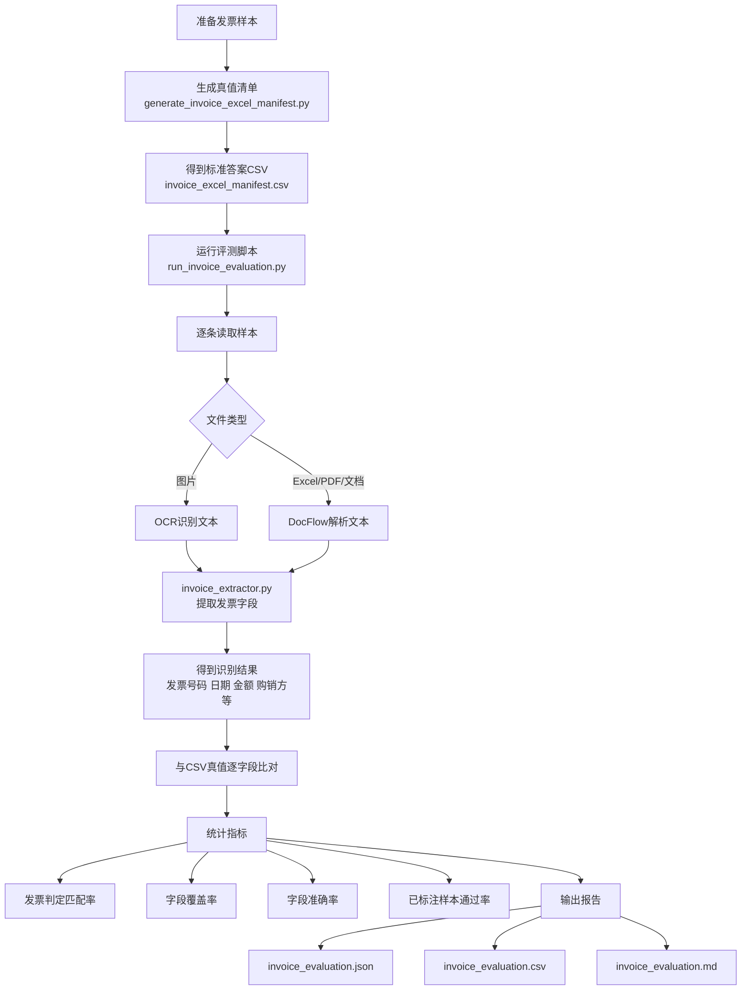
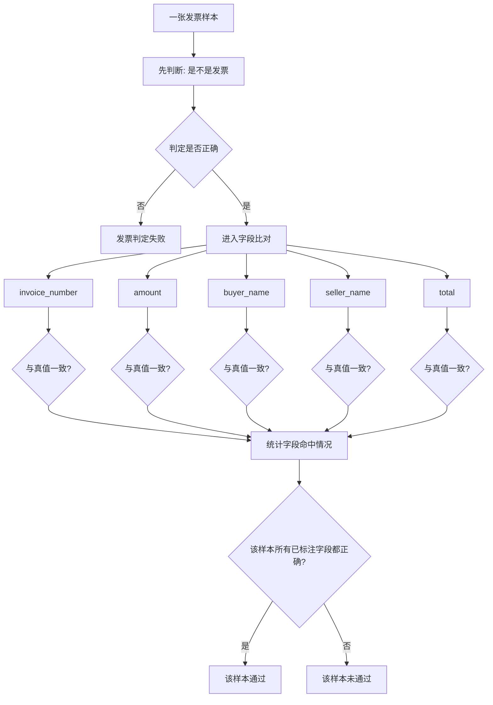

# 发票评测说明

本文档说明两套清单的用途、字段含义和统计口径，目标是把“发票判定能力”和“字段级命中率”分开统计，避免口径混淆。

## 1. 两套清单的定位

### `发票样本/invoice_test_manifest.csv`

- 来源：`InvoiceDatasets-master`
- 主要用途：发票/非发票判定、复杂图片鲁棒性评测
- 关键限制：这个公开数据集本质上是关键词定位数据，不自带完整字段真值
- 结论：如果该清单里的字段列没有人工补标，就不能据此统计真正的字段级命中率

### `发票样本/invoice_excel_manifest.csv`

- 来源：`发票样本/invoices/excel/*.xlsx`
- 主要用途：字段级准确率评测
- 真值来源：直接读取 Excel 中的发票号码、日期、购销方、税号、金额、税额、合计等结构化单元格
- 结论：这套清单可以直接用于论文中的字段级实验

## 2. 推荐实验口径

建议把评测拆成两部分：

1. **公开图片集**：统计发票判定匹配率，展示复杂图像下的鲁棒性
2. **Excel 真值集**：统计字段覆盖率、字段准确率、字段级通过率

这样论证是稳的，不会把“没有字段真值的公开集”误写成“字段级准确率实验”。

## 3. 清单字段说明

两个清单都使用同一套核心字段：

| 字段名 | 含义 |
| --- | --- |
| `sample_id` | 样本编号 |
| `file_name` | 文件名 |
| `source_dir` | 相对样本目录 |
| `sample_type` | 样本类别 |
| `expected_invoice` | 预期是否识别为发票 |
| `invoice_code` | 发票代码 |
| `invoice_number` | 发票号码 |
| `invoice_date` | 开票日期 |
| `amount` | 不含税金额 |
| `tax` | 税额 |
| `total` | 价税合计 |
| `buyer_name` | 购买方名称 |
| `seller_name` | 销售方名称 |
| `buyer_tax_id` | 购买方税号 |
| `seller_tax_id` | 销售方税号 |
| `invoice_type` | 发票类型 |
| `quality_level` | 样本质量等级 |
| `notes` | 备注 |

## 4. 统计指标定义

### 发票判定匹配率

系统输出的 `is_invoice` 与 `expected_invoice` 一致，记为匹配。

### 字段覆盖率

在“已标注字段”中，系统给出了非空结果的比例。

公式：

`字段覆盖率 = 已提取字段数 / 已标注字段数`

### 字段准确率

在“已标注字段”中，系统提取结果与真值完全一致的比例。

公式：

`字段准确率 = 命中字段数 / 已标注字段数`

### 已标注样本通过率

单个样本满足以下条件，记为通过：

- 发票判定正确
- 该样本所有已标注字段全部命中

公式：

`已标注样本通过率 = 已通过的已标注样本数 / 已标注样本总数`

### 测试流程图



### 指标解释图

下面这张图描述“这些指标分别是什么意思”：



### 图示怎么理解

- `invoice_extractor.py` 负责“识别”
- `invoice_excel_manifest.csv` 负责“标准答案”
- `run_invoice_evaluation.py` 负责“判卷”
- 发票判定匹配率看“是不是先认出这是一张发票”
- 字段覆盖率看“该提的字段有没有给出结果”
- 字段准确率看“给出的结果和标准答案是否一致”
- 已标注样本通过率看“整张票是否所有已标注字段都正确”

## 5. 自动生成 Excel 真值清单

执行：

```powershell
.\.venv\Scripts\python.exe .\scripts\generate_invoice_excel_manifest.py
```

默认会读取：

- `发票样本/invoices/excel`

并生成：

- `发票样本/invoice_excel_manifest.csv`

## 6. 运行评测

### 6.1 评测 Excel 真值集

```powershell
.\.venv\Scripts\python.exe .\scripts\run_invoice_evaluation.py .\发票样本\invoice_excel_manifest.csv
```

这条命令用于统计真正的字段级命中率。

### 6.2 评测公开图片集

```powershell
.\.venv\Scripts\python.exe .\scripts\run_invoice_evaluation.py .\发票样本\invoice_test_manifest.csv
```

如果 `invoice_test_manifest.csv` 中没有补齐字段真值，报告会明确提示：该结果只能用于发票判定评测，不能用于字段级准确率结论。

## 7. 报告输出

每次运行后会在 `reports/` 下生成一个时间戳目录，包含：

| 文件 | 说明 |
| --- | --- |
| `invoice_evaluation.json` | 完整结构化结果 |
| `invoice_evaluation.csv` | 展平后的样本明细，可直接筛查错例 |
| `invoice_evaluation.md` | 可直接放进实验记录或论文草稿 |

其中 `invoice_evaluation.csv` 已经展开到字段级，包括每个字段的：

- 标注值
- 提取值
- 是否提取到
- 是否命中

## 8. 论文中建议怎么写

建议按下面口径表述：

- `InvoiceDatasets-master` 用于验证系统在多样化图像场景下的发票判定能力和鲁棒性
- 自建 `invoice_excel_manifest.csv` 用于验证结构化字段提取准确率
- 两类实验分别反映“能否识别为发票”和“能否准确提取字段”，职责清晰
